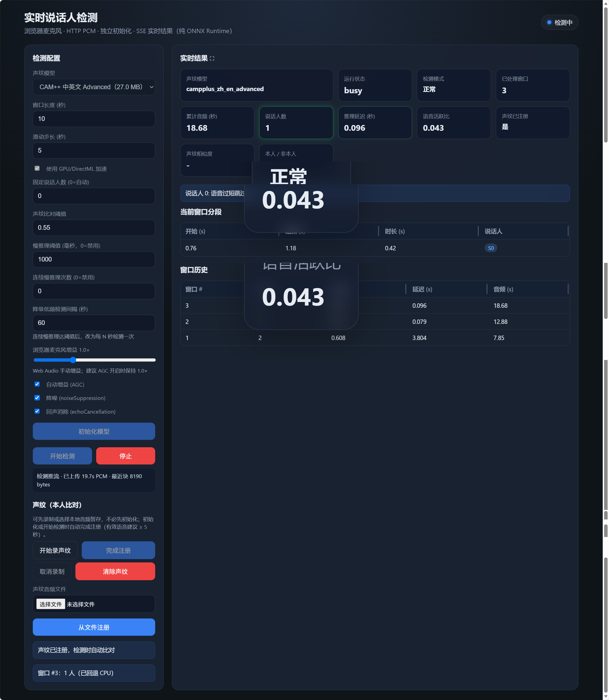

# 本地实时说话人分离（纯 ONNX Runtime）

浏览器麦克风采集 PCM，经 **HTTP POST** 上传；服务端用 **onnxruntime**（Windows 优先 DirectML）做滑窗说话人分离与人数检测，结果经 **SSE** 推送。不依赖 `sherpa-onnx` Python 包。

## 环境准备

```bash
# 在仓库根目录
conda env create -f environment.yml
conda activate speak-local-demo1

# 若 conda 未自动装上 pip 依赖，可再执行：
pip install -r requirements.txt
```

说明：

- Windows 使用 `onnxruntime-directml`（GPU/DirectML → 失败回退 CPU）
- Linux / macOS 使用 `onnxruntime`（CPU）

## 下载模型

```bash
# 默认：segmentation + CAM++ 中英文 Advanced
python scripts/download_models.py

# 查看注册表
python scripts/download_models.py --list

# 下载某个 embedding
python scripts/download_models.py --model eres2netv2_zh_cn

# 下载注册表中全部 embedding（体积很大）
python scripts/download_models.py --all
```

模型来源：

- 分割：`speaker-segmentation-models` → `sherpa-onnx-pyannote-segmentation-3-0`
- 声纹：`speaker-recongition-models`（注意官方 tag 拼写为 recongition）

模型文件保存在 `models/`（已 gitignore）。

## 启动

```bash
python -m server.app
```

浏览器打开：<http://127.0.0.1:8764/>

若端口被占用，可修改 `server/config.py` 中的 `PORT`，或启动时：

```bash
uvicorn server.app:app --host 0.0.0.0 --port 8787
```

## API 一览

| 方法 | 路径 | 作用 |
|------|------|------|
| GET | `/` | 静态 UI |
| GET | `/api/health` | 健康检查 + ORT provider |
| GET | `/api/models` | embedding 模型列表 |
| POST | `/api/initialize` | 加载模型 → ready；若有声纹暂存则自动注册 |
| POST | `/api/start` | 须已 initialize；开始滑窗检测 |
| POST | `/api/stream/chunk` | 上传 raw PCM int16 LE 16kHz mono |
| GET | `/api/status` | 状态快照 |
| GET | `/api/sse/events` | SSE：`status` / `diarization_result` / `error` |
| POST | `/api/voice-enroll/start\|finish\|cancel\|clear` | 声纹录制（未 init 可暂存） |
| POST | `/api/voice-enroll/from-file` | 浏览器解码后的 16k PCM 注册/暂存 |
| POST | `/api/stop` | 停止检测，模型仍保持 ready |

`POST /api/initialize` 示例：

```json
{
  "embedding_model_key": "campplus_zh_en_advanced",
  "use_gpu": true,
  "verify_threshold": 0.55
}
```

`POST /api/start` 示例：

```json
{
  "window_sec": 10,
  "hop_sec": 5,
  "fixed_speaker_num": 0,
  "verify_threshold": 0.55,
  "slow_inference_threshold_ms": 1000,
  "slow_inference_max_consecutive": 5,
  "low_frequency_interval_sec": 60
}
```

PCM 块：`Content-Type: application/octet-stream`，并通过 query `session_id` 或 header `X-Session-Id` 指定会话。上一窗推理未完成时会**跳过**本 hop，避免堆积。声纹本地文件由前端 `decodeAudioData` 转 16k mono PCM 后 POST 到 `/api/voice-enroll/from-file`。

## 已知限制

1. **单机单活跃会话**：再次 `start` 会停止并替换当前会话。
2. **注册 VAD** 使用能量阈值简易过滤，非 Silero；嘈杂环境可能需多录几秒。
3. **聚类阈值** 默认 `0.78`（余弦距离），与 sherpa FastClustering 同量级；人数不准时可调 `fixed_speaker_num`。
4. **模型体积**：`--all` 会下载全部 3dspeaker / wespeaker 系列 ONNX，请按需下载。
5. **浏览器限制**：需 HTTPS 或 localhost 才能访问麦克风；使用已废弃但仍广泛可用的 `ScriptProcessorNode` 采集 PCM。
6. 若个别 release 资源暂时 404，可将对应 `.onnx` 手动放入 `models/`，注册表 key 已预留。

## 效果图


